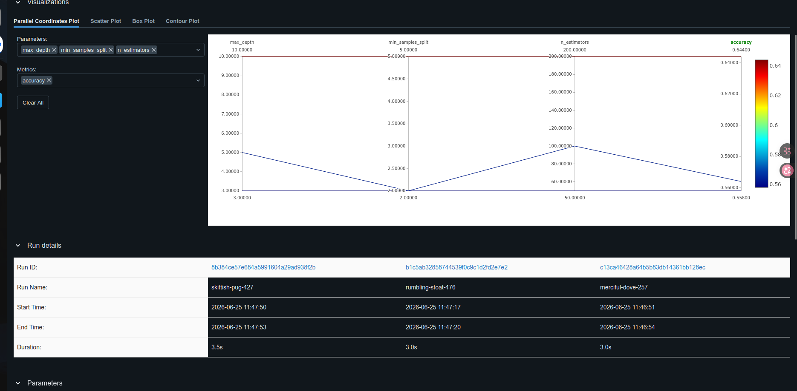
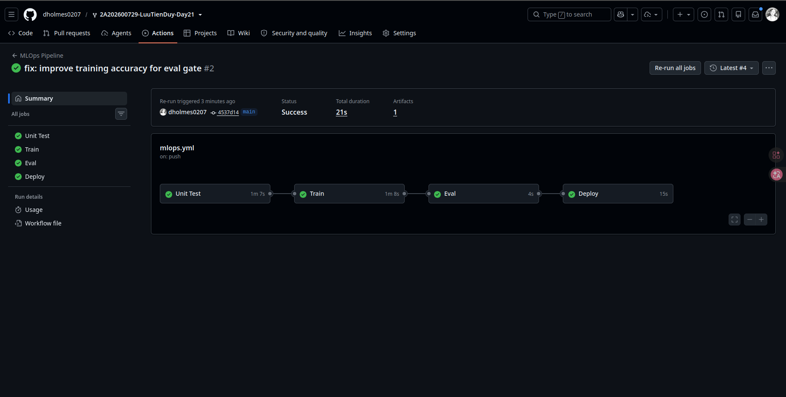
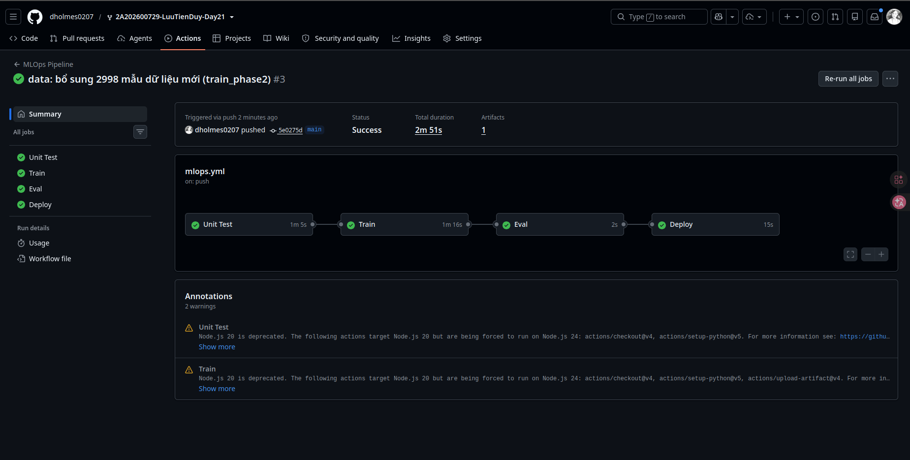

# Bao cao Day 21 - CI/CD for AI Systems

Sinh vien: Luu Tien Duy
Repo: `2A202600729-LuuTienDuy-Day21`

## Tong quan

Lab da hoan thanh 3 buoc:

1. Thuc nghiem cuc bo voi MLflow va RandomForestClassifier.
2. Xay dung pipeline CI/CD tren GitHub Actions, DVC remote tren AWS S3, deploy FastAPI len EC2.
3. Mo phong huan luyen lien tuc khi co du lieu moi bang cach cap nhat DVC pointer va kich hoat pipeline tu dong.

Cloud provider su dung: AWS, region `us-east-1`.

## Cau hinh mo hinh cuoi cung

Mo hinh: `RandomForestClassifier`

```yaml
n_estimators: 200
max_depth: null
min_samples_split: 5
min_samples_leaf: 1
max_features: null
class_weight: balanced
```

Ly do chon: cau hinh nay cho ket qua tot hon tren tap `eval.csv` sau khi bo sung du lieu moi, dong thoi vuot eval gate `accuracy >= 0.70`.

## Ket qua

| Giai doan | Du lieu huan luyen | Accuracy | F1-score |
|---|---:|---:|---:|
| Buoc 2 | 2998 mau | 0.6920 | 0.6918 |
| Buoc 3 | 5996 mau | 0.7540 | 0.7526 |

Ket qua cho thay viec bo sung `train_phase2.csv` vao `train_phase1.csv` giup tang accuracy tu `0.6920` len `0.7540`.

## Bang chung

### Buoc 1 - MLflow experiments



### Buoc 2 - CI/CD deploy thanh cong



### Buoc 3 - Pipeline kich hoat boi commit du lieu



## Kho khan va cach giai quyet

- Khong su dung duoc GCP account, nen chuyen sang AWS S3 va EC2.
- IAM user ban dau thieu quyen tao bucket S3, da tao IAM group/user rieng cho lab va cap quyen S3 can thiet.
- GitHub Actions ban dau bi chan deploy vi accuracy duoi `0.70`; da tinh lai sieu tham so va bo sung du lieu phase 2 de model vuot nguong.
- EC2 service ban dau khong doc duoc model tu S3 do thieu credentials; da gan IAM role cho EC2 voi quyen doc model tren S3.

## Xac nhan hoan thanh

- DVC da quan ly cac file du lieu bang `*.csv.dvc`.
- GitHub Actions co 4 jobs: Unit Test, Train, Eval, Deploy.
- Eval gate chi cho deploy khi accuracy dat nguong.
- FastAPI tren EC2 phuc vu endpoint `/health` va `/predict`.
- Buoc 3 duoc kich hoat boi commit du lieu: `data/train_phase1.csv.dvc`.
